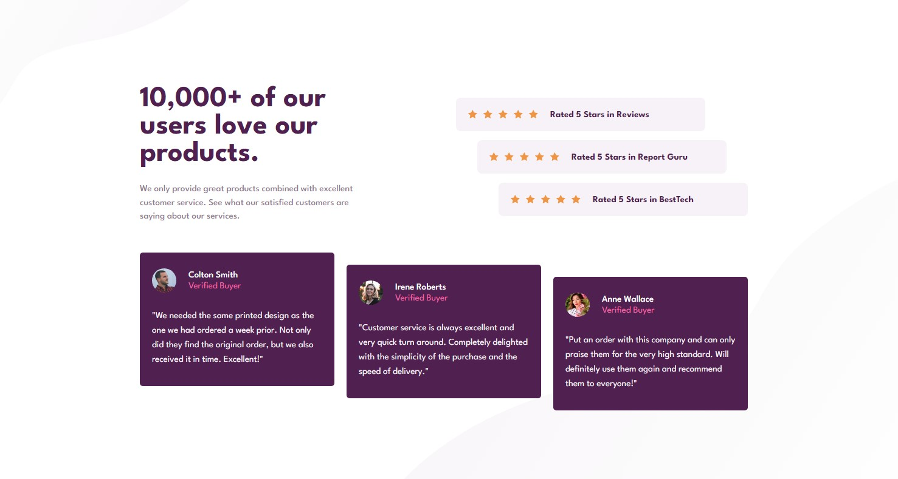

# Frontend Mentor - Social proof section solution

This is a solution to the [Social proof section challenge on Frontend Mentor](https://www.frontendmentor.io/challenges/social-proof-section-6e0qTv_bA). Frontend Mentor challenges help you improve your coding skills by building realistic projects.

## The challenge

Users should be able to:

- View the optimal layout for the section depending on their device's screen size

## Links

- Live Site URL: [Social proof section](https://rstrzelczyk98.github.io/social-proof-section/)

## Built with

- HTML5
- CSS3
- Mobile-first workflow
